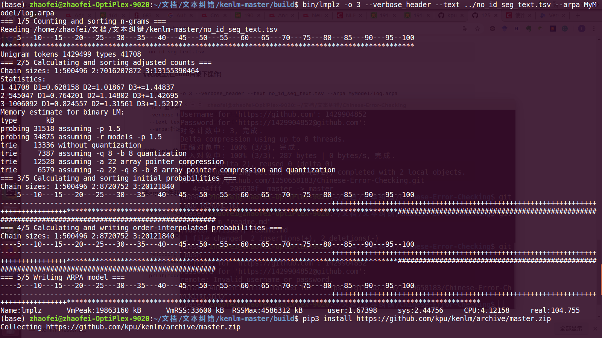

# Chinese-Error-Checking

This is my first attempt in the direction of nlp，it is dedicated to complete a Chinese error detection!

------
# 解决方案
- 中文纠错分为两步走，第一步是错误检测，第二步是错误纠正；
- 错误检测部分先通过中文分词器切词，由于句子中含有错别字，所以切词结果往往会有切分错误的情况，这样从字粒度和词粒度两方面检测错误，整合这两种粒度的疑似错误结果，形成疑似错误位置候选集；
- 错误纠正部分，是遍历所有的疑似错误位置，并使用音似、形似词典替换错误位置的词，然后通过语言模型计算句子困惑度，对所有候选集结果比较并排序，得到最优纠正词；

# 模型
- 通用语言模型(使用人民日报2014版熟语料)
- 领域特定语言模型（医学领域预料）

## 错误检测
- 字粒度：语言模型困惑度（ppl）检测某字的似然概率值低于句子文本平均值，则判定该字是疑似错别字的概率大。
- 词粒度：切词后不在词典中的词是疑似错词的概率大(新词发现)。

## 错误纠正
- 通过错误检测定位所有疑似错误后，取所有疑似错字的音似、形似候选词;
- 使用候选词替换，基于语言模型得到类似翻译模型的候选排序结果，得到最优纠正词;

# 实验部分
## 1. Data Process

| 文件             | 含义                                                         |
| :--------------- | :----------------------------------------------------------- |
| Extract_PDF.py   | 该文件包含了将PDF抽取出TXT的基本操作，其处理结果为输入一个文件目录，其自动便利此目录下的子目录与.pdf文件，同时将抽取的.txt文件放入到与.pdf同目录下的文件夹中. 抽取模式为利用pdfminer库，实现识别pdf文件中的TEXT信息，并添加启发式规则，合并应该属于同一条语句的TEXT，目前启发式规则仍在不断完善中 |
| TXT2TSV.py       | 实现将抽取的TXT转化为id \t contence \n 格式的.tsv文件，同样输入文件目录，程序自动递归遍历，输出文件再程序同目录下，其基本处理模式为判断中英文标点作为分隔符，并过滤长度<10的句子 |
| tot_acc_sent.tsv | 存放数据相关，包括抽取语料，分词后训练集，未分词测试集等     |
| Model\           | 存放计算出的ngrams模型                                       |
| result\          | c                                                            |

------

## 2. Language Model

### 2.1 kenlm统计语言模型使用(已完成测试)
#### 2.1.1 下载
```bash
https://github.com/kpu/kenlm
```
#### 2.1.2 安装Boost(kenlm需要的依赖)
```bash
下载boost_1_67_0.tar.bz2(https://www.boost.org/users/history/version_1_67_0.html)
tar --bzip2 -xf boost_1_67_0.tar.bz2
cd boost_1_67/
./bootstrap.sh --prefix=/usr/local
sudo ./b2 install --with=all
sudo apt install libbz2-dev
sudo apt install liblzma-dev
```
#### 2.1.3 编译并安装kenlm
```bash
cd kenlm
mkdir -p build
cd build
cmake ..
make -j 4
```
### 2.2 训练领域特定语言模型
#### 2.2.1 数据准备(分词的文件)
```bash
no_id_seg_text.tsv
```
#### 2.2.2 训练模型(在build目录下操作)
```bash
bin/lmplz -o 3 --verbose_header --text no_id_seg_text.tsv --arpa MyModel/log.arpa

-o n:最高采用n-gram语法
-verbose_header:在生成的文件头位置加上统计信息
--text text_file:指定存放预料的txt文件
--arpa:指定输出的arpa文件
```



### 2.3 使用训练的模型纠错
#### 2.3.1 安装kenlm的python包

```bash
pip3 install https://github.com/kpu/kenlm/archive/master.zip
```
#### 2.3.2 将arpa文件转换为binary文件(在build目录下操作)
```bash
bin/build_binary -s MyModel/log.arpa MyModel/log.bin
```

#### 2.3.3 使用训练的模型预测句子的概率
```bash
#encoding:utf8
import kenlm
model = kenlm.Model('MyModel/log.bin')
print(model.score('我 是 中国人 .',bos = True,eos = True))
```


# 算法更新及结果显示

更新文件放入result文件夹下。

```
数据解释：每个错误下有5行数据，分别代表检错精确率，检错召回率，纠错精确度，纠错召回率，纠正比例
eg:在origin0309.txt行、同音字列下的5行数据分别表示：
91/212：共检测出212处错误，其中91处真正包含错误；
91/100：原始句子中共有100处错误，模型检测出91处；
77/125：共纠正了125处错误，其中77处纠正地正确；
77/100：原始句子中共有100处错误，模型纠正出77处；
64/100：测试错误语句100个句子，完全改出64个。

p.s. 由于纠错加字的可能，纠错的准确率与召回率的计算可能还存在一些问题（可能比实际值高一些），将在后续迭代
```


<table border="1">
	<tbody>
		<tr>
			<td>
				<p>
					更新文件
				</p>
			</td>
			<td>
				<p>
					算法介绍
				</p>
			</td>
			<td>
				<p>
					同音字
				</p>
			</td>
			<td>
				<p>
					同形字
				</p>
			</td>
			<td>
				<p>
					漏字
				</p>
			</td>
			<td>
				<p>
					同音词
				</p>
			</td>
			<td>
				<p>
					简易分析
				</p>
			</td>
		</tr>
		<tr>
			<td rowspan="5">
				<p>
					Origin
				</p>
				<p>
					0309.txt
				</p>
			</td>
			<td rowspan="5">
				<p>
					原始模型；不存在加字的处理；不能处理漏字；且改错时强制限制完全同音。
				</p>
			</td>
			<td>
				<p>
					91/212
				</p>
			</td>
			<td>
				<p>
					89/187
				</p>
			</td>
			<td>
				<p>
					12/138
				</p>
			</td>
			<td>
				<p>
					68/152
				</p>
			</td>
			<td rowspan="5">
				<p>
					<br />
				</p>
			</td>
		</tr>
		<tr>
			<td>
				<p>
					91/100
				</p>
			</td>
			<td>
				<p>
					89/100
				</p>
			</td>
			<td>
				<p>
					12/100
				</p>
			</td>
			<td>
				<p>
					37/100
				</p>
			</td>
		</tr>
		<tr>
			<td>
				<p>
					77/125
				</p>
			</td>
			<td>
				<p>
					79/127
				</p>
			</td>
			<td>
				<p>
					0/69
				</p>
			</td>
			<td>
				<p>
					16/83
				</p>
			</td>
		</tr>
		<tr>
			<td>
				<p>
					77/100
				</p>
			</td>
			<td>
				<p>
					79/100
				</p>
			</td>
			<td>
				<p>
					0/100
				</p>
			</td>
			<td>
				<p>
					16/100
				</p>
			</td>
		</tr>
		<tr>
			<td>
				<p>
					64/100
				</p>
			</td>
			<td>
				<p>
					58/100
				</p>
			</td>
			<td>
				<p>
					0/100
				</p>
			</td>
			<td>
				<p>
					15/100
				</p>
			</td>
		</tr>
		<tr>
			<td rowspan="5">
				<p>
					Ours
				</p>
				<p>
					0309.txt
				</p>
			</td>
			<td rowspan="5">
				<p>
					领域小语料模型；threshold=1.0；关闭漏字纠错；改错时强制限制完全同音；
				</p>
			</td>
			<td>
				<p>
					93/223
				</p>
			</td>
			<td>
				<p>
					85/220
				</p>
			</td>
			<td>
				<p>
					28/223
				</p>
			</td>
			<td>
				<p>
					85/222
				</p>
			</td>
			<td rowspan="5">
				<p>
					利用小语料模型，在使用跟原始模型相似的框架时，我们的小语料模型较优于原始模型，但是这种纠错使用了强限制，与实际生活的语句错误存在偏差。
				</p>
			</td>
		</tr>
		<tr>
			<td>
				<p>
					93/100
				</p>
			</td>
			<td>
				<p>
					85/100
				</p>
			</td>
			<td>
				<p>
					28/100
				</p>
			</td>
			<td>
				<p>
					61/100
				</p>
			</td>
		</tr>
		<tr>
			<td>
				<p>
					80/108
				</p>
			</td>
			<td>
				<p>
					71/97
				</p>
			</td>
			<td>
				<p>
					0/64
				</p>
			</td>
			<td>
				<p>
					28/83
				</p>
			</td>
		</tr>
		<tr>
			<td>
				<p>
					80/100
				</p>
			</td>
			<td>
				<p>
					71/100
				</p>
			</td>
			<td>
				<p>
					0/100
				</p>
			</td>
			<td>
				<p>
					28/100
				</p>
			</td>
		</tr>
		<tr>
			<td>
				<p>
					69/100
				</p>
			</td>
			<td>
				<p>
					65/100
				</p>
			</td>
			<td>
				<p>
					0/100
				</p>
			</td>
			<td>
				<p>
					26/100
				</p>
			</td>
		</tr>
		<tr>
			<td rowspan="5">
				<p>
					Correction
				</p>
				<p>
					_word
				</p>
				<p>
					_0312.txt
				</p>
			</td>
			<td rowspan="5">
				<p>
					当前框架使用字粒度的语言模型进行检错，语言模型n_grams中n为2、3、4，对其打分进行平均处理。使用MAD算法检错，threshold=1.2
				</p>
			</td>
			<td>
				<p>
					90/312
				</p>
			</td>
			<td>
				<p>
					82/262
				</p>
			</td>
			<td>
				<p>
					41/269
				</p>
			</td>
			<td>
				<p>
					93/270
				</p>
			</td>
			<td rowspan="5">
				<p>
					由于当前框架的纠错模型尚未优化，目前可能正确词为编辑距离为1的词，关闭漏字修改模块，不能与之前模块进行完全横向对比。可以看到，其检错召回率与之前框架相当，但是其准确率较低，此外，在漏字上的召回率高于原始框架。
				</p>
			</td>
		</tr>
		<tr>
			<td>
				<p>
					90/100
				</p>
			</td>
			<td>
				<p>
					82/100
				</p>
			</td>
			<td>
				<p>
					41/100
				</p>
			</td>
			<td>
				<p>
					74/100
				</p>
			</td>
		</tr>
		<tr>
			<td>
				<p>
					58/99
				</p>
			</td>
			<td>
				<p>
					38/81
				</p>
			</td>
			<td>
				<p>
					0/39
				</p>
			</td>
			<td>
				<p>
					21/50
				</p>
			</td>
		</tr>
		<tr>
			<td>
				<p>
					58/100
				</p>
			</td>
			<td>
				<p>
					38/100
				</p>
			</td>
			<td>
				<p>
					0/100
				</p>
			</td>
			<td>
				<p>
					21/100
				</p>
			</td>
		</tr>
		<tr>
			<td>
				<p>
					51/100
				</p>
			</td>
			<td>
				<p>
					36/100
				</p>
			</td>
			<td>
				<p>
					0/100
				</p>
			</td>
			<td>
				<p>
					19/100
				</p>
			</td>
		</tr>
		<tr>
			<td rowspan="5">
				<p>
					Origin
				</p>
				<p>
					0313
				</p>
				<p>
					.txt
				</p>
			</td>
			<td rowspan="5">
				<p>
					同origin0309，原始模型；不存在加字的处理；不能处理漏字；且改错时强制限制完全同音。
				</p>
			</td>
			<td>
				<p>
					88/205
				</p>
			</td>
			<td>
				<p>
					89/191
				</p>
			</td>
			<td>
				<p>
					64/148
				</p>
			</td>
			<td>
				<p>
					64/132
				</p>
			</td>
			<td rowspan="5">
				<p>
					之前的训练是将提取出的句子进行短切分后划分训练集，猜想其可能损失部分n_grams信息，因此训练一版原始长句子的训练集，此为新版的验证集评估。
				</p>
			</td>
		</tr>
		<tr>
			<td>
				<p>
					88/100
				</p>
			</td>
			<td>
				<p>
					89/100
				</p>
			</td>
			<td>
				<p>
					54/100
				</p>
			</td>
			<td>
				<p>
					32/100
				</p>
			</td>
		</tr>
		<tr>
			<td>
				<p>
					79/115
				</p>
			</td>
			<td>
				<p>
					66/116
				</p>
			</td>
			<td>
				<p>
					0/72
				</p>
			</td>
			<td>
				<p>
					29/71
				</p>
			</td>
		</tr>
		<tr>
			<td>
				<p>
					82/100
				</p>
			</td>
			<td>
				<p>
					75/100
				</p>
			</td>
			<td>
				<p>
					0/100
				</p>
			</td>
			<td>
				<p>
					19/100
				</p>
			</td>
		</tr>
		<tr>
			<td>
				<p>
					63/100
				</p>
			</td>
			<td>
				<p>
					60/100
				</p>
			</td>
			<td>
				<p>
					0/100
				</p>
			</td>
			<td>
				<p>
					16/100
				</p>
			</td>
		</tr>
		<tr>
			<td rowspan="5">
				<p>
					Our0313
				</p>
				<p>
					.txt
				</p>
			</td>
			<td rowspan="5">
				<p>
					领域小语料+通用大语料,2.0GB，采用长句子直接提取n_grams信息，关闭漏字更正模块，限制候选拼音相同。
				</p>
			</td>
			<td>
				<p>
					90/216
				</p>
			</td>
			<td>
				<p>
					90/188
				</p>
			</td>
			<td>
				<p>
					79/168
				</p>
			</td>
			<td>
				<p>
					100/181
				</p>
			</td>
			<td rowspan="5">
				<p>
					通过与之前小语料的对比，发现模型在增大语料时能够一定能力增大纠错性能。然而仍然存在较多错检与错纠，并且性能依旧需要依赖于拼音相同等限制，与实际情况存在偏差。
				</p>
			</td>
		</tr>
		<tr>
			<td>
				<p>
					90/100
				</p>
			</td>
			<td>
				<p>
					90/100
				</p>
			</td>
			<td>
				<p>
					61/100
				</p>
			</td>
			<td>
				<p>
					45/100
				</p>
			</td>
		</tr>
		<tr>
			<td>
				<p>
					84/99
				</p>
			</td>
			<td>
				<p>
					75/106
				</p>
			</td>
			<td>
				<p>
					0/49
				</p>
			</td>
			<td>
				<p>
					46/79
				</p>
			</td>
		</tr>
		<tr>
			<td>
				<p>
					88/100
				</p>
			</td>
			<td>
				<p>
					83/100
				</p>
			</td>
			<td>
				<p>
					0/100
				</p>
			</td>
			<td>
				<p>
					24/100
				</p>
			</td>
		</tr>
		<tr>
			<td>
				<p>
					78/100
				</p>
			</td>
			<td>
				<p>
					71/100
				</p>
			</td>
			<td>
				<p>
					0/100
				</p>
			</td>
			<td>
				<p>
					24/100
				</p>
			</td>
		</tr>
		<tr>
			<td rowspan="5">
				<p>
					aug_
				</p>
				<p>
					0325_
				</p>
				<p>
					o.txt
				</p>
			</td>
			<td rowspan="5">
				<p>
					使用同义词替换增强策略，语料模型184M,关闭漏字更正模块，限制候选拼音相同。
				</p>
			</td>
			<td>
				<p>
					91/220
				</p>
			</td>
			<td>
				<p>
					95/195
				</p>
			</td>
			<td>
				<p>
					80/152
				</p>
			</td>
			<td>
				<p>
					114/206
				</p>
			</td>
			<td rowspan="5">
				<p>
					同比利用通用领域增强的语料，在领域语料中利用同义词替换增强策略在200M的数量级可以媲美原始的2G语言模型，并且同形字和同音词的纠错效果更好。
				</p>
			</td>
		</tr>
		<tr>
			<td>
				<p>
					91/100
				</p>
			</td>
			<td>
				<p>
					95/100
				</p>
			</td>
			<td>
				<p>
					60/100
				</p>
			</td>
			<td>
				<p>
					54/100
				</p>
			</td>
		</tr>
		<tr>
			<td>
				<p>
					84/98
				</p>
			</td>
			<td>
				<p>
					80/103
				</p>
			</td>
			<td>
				<p>
					0/30
				</p>
			</td>
			<td>
				<p>
					70/103
				</p>
			</td>
		</tr>
		<tr>
			<td>
				<p>
					87/100
				</p>
			</td>
			<td>
				<p>
					88/100
				</p>
			</td>
			<td>
				<p>
					0/100
				</p>
			</td>
			<td>
				<p>
					35/100
				</p>
			</td>
		</tr>
		<tr>
			<td>
				<p>
					78/100
				</p>
			</td>
			<td>
				<p>
					82/100
				</p>
			</td>
			<td>
				<p>
					0/100
				</p>
			</td>
			<td>
				<p>
					35/100
				</p>
			</td>
		</tr>
		<tr>
			<td rowspan="5">
				<p>
					Ours
				</p>
				<p>
					0313_
				</p>
				<p>
					add.txt
				</p>
			</td>
			<td rowspan="5">
				<p>
					使用上述语料，加入漏字纠错模块，去除候选词的强限制，改为限制简拼相同
				</p>
			</td>
			<td>
				<p>
					97/305
				</p>
			</td>
			<td>
				<p>
					94/266
				</p>
			</td>
			<td>
				<p>
					102/267
				</p>
			</td>
			<td>
				<p>
					106/267
				</p>
			</td>
			<td rowspan="5">
				<p>
					开启漏字纠错后，去除强限制后，可以发现降低了模型其他错误类型纠错准确率与召回率。
				</p>
			</td>
		</tr>
		<tr>
			<td>
				<p>
					97/100
				</p>
			</td>
			<td>
				<p>
					94/100
				</p>
			</td>
			<td>
				<p>
					75/100
				</p>
			</td>
			<td>
				<p>
					69/100
				</p>
			</td>
		</tr>
		<tr>
			<td>
				<p>
					76/165
				</p>
			</td>
			<td>
				<p>
					57/162
				</p>
			</td>
			<td>
				<p>
					39/153
				</p>
			</td>
			<td>
				<p>
					22/175
				</p>
			</td>
		</tr>
		<tr>
			<td>
				<p>
					73/100
				</p>
			</td>
			<td>
				<p>
					65/100
				</p>
			</td>
			<td>
				<p>
					43/100
				</p>
			</td>
			<td>
				<p>
					18/100
				</p>
			</td>
		</tr>
		<tr>
			<td>
				<p>
					48/100
				</p>
			</td>
			<td>
				<p>
					40/100
				</p>
			</td>
			<td>
				<p>
					28/100
				</p>
			</td>
			<td>
				<p>
					12/100
				</p>
			</td>
		</tr>
		<tr>
			<td rowspan="5">
				<p>
					aug_
				</p>
				<p>
					0325_
				</p>
				<p>
					add.txt
				</p>
			</td>
			<td rowspan="5">
				<p>
					使用同义词替换增强策略，语料模型184M,加入漏字纠错模块，去除候选词的强限制，改为限制简拼相同
				</p>
			</td>
			<td>
				<p>
					91/246
				</p>
			</td>
			<td>
				<p>
					96/213
				</p>
			</td>
			<td>
				<p>
					91/188
				</p>
			</td>
			<td>
				<p>
					112/224
				</p>
			</td>
			<td rowspan="5">
				<p>
					同比利用通用领域增强的语料，模型在开启漏字纠错后，同音字、同形字、同音词的检错均优于通用领域增强语料的结果。
				</p>
			</td>
		</tr>
		<tr>
			<td>
				<p>
					91/100
				</p>
			</td>
			<td>
				<p>
					96/100
				</p>
			</td>
			<td>
				<p>
					66/100
				</p>
			</td>
			<td>
				<p>
					63/100
				</p>
			</td>
		</tr>
		<tr>
			<td>
				<p>
					82/136
				</p>
			</td>
			<td>
				<p>
					63/136
				</p>
			</td>
			<td>
				<p>
					33/102
				</p>
			</td>
			<td>
				<p>
					26/133
				</p>
			</td>
		</tr>
		<tr>
			<td>
				<p>
					82/100
				</p>
			</td>
			<td>
				<p>
					69/100
				</p>
			</td>
			<td>
				<p>
					37/100
				</p>
			</td>
			<td>
				<p>
					20/100
				</p>
			</td>
		</tr>
		<tr>
			<td>
				<p>
					53/100
				</p>
			</td>
			<td>
				<p>
					48/100
				</p>
			</td>
			<td>
				<p>
					29/100
				</p>
			</td>
			<td>
				<p>
					17/100
				</p>
			</td>
		</tr>
		<tr>
			<td rowspan="5">
				<p>
					Aug
				</p>
				<p>
					0325_
				</p>
				<p>
					add&amp;s
				</p>
				<p>
					.txt
				</p>
			</td>
			<td rowspan="5">
				<p>
					在上者的基础上进行一些同音词候选生成策略优化。
				</p>
			</td>
			<td>
				<p>
					91/246
				</p>
			</td>
			<td>
				<p>
					96/213
				</p>
			</td>
			<td>
				<p>
					91/188
				</p>
			</td>
			<td>
				<p>
					112/224
				</p>
			</td>
			<td rowspan="5">
				<p>
					在同音词错误上有一定提升。
				</p>
			</td>
		</tr>
		<tr>
			<td>
				<p>
					91/100
				</p>
			</td>
			<td>
				<p>
					96/100
				</p>
			</td>
			<td>
				<p>
					66/100
				</p>
			</td>
			<td>
				<p>
					63/100
				</p>
			</td>
		</tr>
		<tr>
			<td>
				<p>
					82/136
				</p>
			</td>
			<td>
				<p>
					63/136
				</p>
			</td>
			<td>
				<p>
					33/102
				</p>
			</td>
			<td>
				<p>
					41/135
				</p>
			</td>
		</tr>
		<tr>
			<td>
				<p>
					83/100
				</p>
			</td>
			<td>
				<p>
					69/100
				</p>
			</td>
			<td>
				<p>
					37/100
				</p>
			</td>
			<td>
				<p>
					33/100
				</p>
			</td>
		</tr>
		<tr>
			<td>
				<p>
					53/100
				</p>
			</td>
			<td>
				<p>
					48/100
				</p>
			</td>
			<td>
				<p>
					29/100
				</p>
			</td>
			<td>
				<p>
					27/100
				</p>
			</td>
		</tr>
		<tr>
			<td rowspan="5">
				<p>
					Correction
				</p>
				<p>
					_word_
				</p>
				<p>
					0314.txt
				</p>
			</td>
			<td rowspan="5">
				<p>
					使用新划分的训练集与测试集，重新对其使用的多个语料进行训练，关闭漏字纠错。
				</p>
			</td>
			<td>
				<p>
					97/293
				</p>
			</td>
			<td>
				<p>
					96/280
				</p>
			</td>
			<td>
				<p>
					121/265
				</p>
			</td>
			<td>
				<p>
					125/275
				</p>
			</td>
			<td rowspan="5">
				<p>
					由于其候选的过滤更为粗糙，但是其纠错正确率却高于我们的模型，认为为候选打分的方式值得借鉴，下一步我们的模型将尝试加入该模型的打分方式进行对比。
				</p>
			</td>
		</tr>
		<tr>
			<td>
				<p>
					97/100
				</p>
			</td>
			<td>
				<p>
					96/100
				</p>
			</td>
			<td>
				<p>
					77/100
				</p>
			</td>
			<td>
				<p>
					86/100
				</p>
			</td>
		</tr>
		<tr>
			<td>
				<p>
					57/99
				</p>
			</td>
			<td>
				<p>
					58/96
				</p>
			</td>
			<td>
				<p>
					4/58
				</p>
			</td>
			<td>
				<p>
					17/48
				</p>
			</td>
		</tr>
		<tr>
			<td>
				<p>
					60/100
				</p>
			</td>
			<td>
				<p>
					65/100
				</p>
			</td>
			<td>
				<p>
					10/100
				</p>
			</td>
			<td>
				<p>
					17/100
				</p>
			</td>
		</tr>
		<tr>
			<td>
				<p>
					54/100
				</p>
			</td>
			<td>
				<p>
					52/100
				</p>
			</td>
			<td>
				<p>
					0/100
				</p>
			</td>
			<td>
				<p>
					16/100
				</p>
			</td>
		</tr>
		<tr>
			<td rowspan="5">
				<p>
					Baidu
				</p>
				<p>
					_api.
				</p>
				<p>
					txt
				</p>
			</td>
			<td rowspan="5">
				<p>
					远程调用百度云中提供的中文纠错API进行纠错尝试，从结构来看，其不能处理漏字，前不返回检错信息。
				</p>
			</td>
			<td>
				<p>
					0/0
				</p>
			</td>
			<td>
				<p>
					0/0
				</p>
			</td>
			<td>
				<p>
					0/0
				</p>
			</td>
			<td>
				<p>
					0/0
				</p>
			</td>
			<td rowspan="5">
				<p>
					从效果来看，百度提供的API在同音和同形的检错上表现并不佳，在同音词表现与n-grams模型以及BERT模型更为接近。
				</p>
			</td>
		</tr>
		<tr>
			<td>
				<p>
					0/100
				</p>
			</td>
			<td>
				<p>
					0/100
				</p>
			</td>
			<td>
				<p>
					0/100
				</p>
			</td>
			<td>
				<p>
					0/100
				</p>
			</td>
		</tr>
		<tr>
			<td>
				<p>
					19/24
				</p>
			</td>
			<td>
				<p>
					16/22
				</p>
			</td>
			<td>
				<p>
					0/4
				</p>
			</td>
			<td>
				<p>
					28/36
				</p>
			</td>
		</tr>
		<tr>
			<td>
				<p>
					20/100
				</p>
			</td>
			<td>
				<p>
					20/100
				</p>
			</td>
			<td>
				<p>
					0/100
				</p>
			</td>
			<td>
				<p>
					24/100
				</p>
			</td>
		</tr>
		<tr>
			<td>
				<p>
					18/100
				</p>
				<p>
					&nbsp;&nbsp;&nbsp;&nbsp;&nbsp;&nbsp;&nbsp;&nbsp;&nbsp;
				</p>
			</td>
			<td>
				<p>
					17/100
				</p>
			</td>
			<td>
				<p>
					0/100
				</p>
			</td>
			<td>
				<p>
					23/100
				</p>
			</td>
		</tr>
		<tr>
			<td rowspan="5">
				<p>
					Auto
				</p>
				<p>
					checher4
				</p>
				<p>
					Chinese
				</p>
				<p>
					_log.txt
				</p>
			</td>
			<td rowspan="5">
				<p>
					基于预训练的词频信息进行纠错，对每一个词频小于设定阈值的词均进行纠错尝试，同样不具备独立的纠错模块。
				</p>
			</td>
			<td>
				<p>
					0/0
				</p>
			</td>
			<td>
				<p>
					0/0
				</p>
			</td>
			<td>
				<p>
					0/0
				</p>
			</td>
			<td>
				<p>
					0/0
				</p>
			</td>
			<td rowspan="5">
				<p>
					基于词频的纠错模型，理论上要比基于n-grams的模型更弱效一些。实验结果与预期相同。
				</p>
			</td>
		</tr>
		<tr>
			<td>
				<p>
					0/100
				</p>
			</td>
			<td>
				<p>
					0/100
				</p>
			</td>
			<td>
				<p>
					0/100
				</p>
			</td>
			<td>
				<p>
					0/100
				</p>
			</td>
		</tr>
		<tr>
			<td>
				<p>
					38/95
				</p>
			</td>
			<td>
				<p>
					14/100
				</p>
			</td>
			<td>
				<p>
					4/59
				</p>
			</td>
			<td>
				<p>
					6/55
				</p>
			</td>
		</tr>
		<tr>
			<td>
				<p>
					38/100
				</p>
			</td>
			<td>
				<p>
					12/100
				</p>
			</td>
			<td>
				<p>
					0/100
				</p>
			</td>
			<td>
				<p>
					2/100
				</p>
			</td>
		</tr>
		<tr>
			<td>
				<p>
					27/100
				</p>
			</td>
			<td>
				<p>
					8/100
				</p>
			</td>
			<td>
				<p>
					0/100
				</p>
			</td>
			<td>
				<p>
					2/100
				</p>
			</td>
		</tr>
		<tr>
			<td>
				<p>
					<br />
				</p>
			</td>
			<td>
				<p>
					<br />
				</p>
			</td>
			<td>
				<p>
					<br />
				</p>
			</td>
			<td>
				<p>
					<br />
				</p>
			</td>
			<td>
				<p>
					<br />
				</p>
			</td>
			<td>
				<p>
					<br />
				</p>
			</td>
			<td>
				<p>
					<br />
				</p>
			</td>
		</tr>
	</tbody>
</table>
<p>
	<br />
</p>
<p>
	<br />
</p>


## 深度算法更新及结果展示

```
当前能够展现出纠错能力的为基于BERT预训练的模型，同期正在训练的包括Conv_seq2seq模型以及seq2seq_attention模型都是类似于翻译语句的训练形式，但是其最终的表现形式均不理想，具体为seq2seq_attention经常翻译出奇怪的句子，如在原句后加很多字；而Conv_seq2seq则表现在对错误不敏感，直接将原句翻译出来。二者的训练语料是相同的，均是CGED16-18三年的语料。BERT模型采用的是作者预训练好的基于人民日报微调的模型，工作效果较好。

目前正在对Conv_seq2seq模型以及seq2seq_attention继续训练，（colab的GPU对其二者的框架似乎不太兼容，有时训练可能7-8items/s,有时只有1-2items/s（这是CPU的速度）），似乎GPU有的时候没有用到，问题也在调研。
```


<table border="1">
	<tbody>
		<tr>
			<td>
				<p>
					更新文件
				</p>
			</td>
			<td>
				<p>
					算法介绍
				</p>
			</td>
			<td>
				<p>
					同音字
				</p>
			</td>
			<td>
				<p>
					同形字
				</p>
			</td>
			<td>
				<p>
					漏字
				</p>
			</td>
			<td>
				<p>
					同音词
				</p>
			</td>
			<td>
				<p>
					简易分析
				</p>
			</td>
		</tr>
		<tr>
			<td rowspan="5">
				<p>
					Origin
				</p>
				<p>
					0309.txt
				</p>
			</td>
			<td rowspan="5">
				<p>
					原始模型；不存在加字的处理；不能处理漏字；且改错时强制限制完全同音。
				</p>
			</td>
			<td>
				<p>
					91/212
				</p>
			</td>
			<td>
				<p>
					89/187
				</p>
			</td>
			<td>
				<p>
					12/138
				</p>
			</td>
			<td>
				<p>
					68/152
				</p>
			</td>
			<td rowspan="5">
				<p>
					<br />
				</p>
			</td>
		</tr>
		<tr>
			<td>
				<p>
					91/100
				</p>
			</td>
			<td>
				<p>
					89/100
				</p>
			</td>
			<td>
				<p>
					12/100
				</p>
			</td>
			<td>
				<p>
					37/100
				</p>
			</td>
		</tr>
		<tr>
			<td>
				<p>
					77/125
				</p>
			</td>
			<td>
				<p>
					79/127
				</p>
			</td>
			<td>
				<p>
					0/69
				</p>
			</td>
			<td>
				<p>
					16/83
				</p>
			</td>
		</tr>
		<tr>
			<td>
				<p>
					77/100
				</p>
			</td>
			<td>
				<p>
					79/100
				</p>
			</td>
			<td>
				<p>
					0/100
				</p>
			</td>
			<td>
				<p>
					16/100
				</p>
			</td>
		</tr>
		<tr>
			<td>
				<p>
					64/100
				</p>
			</td>
			<td>
				<p>
					58/100
				</p>
			</td>
			<td>
				<p>
					0/100
				</p>
			</td>
			<td>
				<p>
					15/100
				</p>
			</td>
		</tr>
		<tr>
			<td rowspan="5">
				<p>
					Ours
				</p>
				<p>
					0309.txt
				</p>
			</td>
			<td rowspan="5">
				<p>
					领域小语料模型；threshold=1.0；关闭漏字纠错；改错时强制限制完全同音；
				</p>
			</td>
			<td>
				<p>
					93/223
				</p>
			</td>
			<td>
				<p>
					85/220
				</p>
			</td>
			<td>
				<p>
					28/223
				</p>
			</td>
			<td>
				<p>
					85/222
				</p>
			</td>
			<td rowspan="5">
				<p>
					利用小语料模型，在使用跟原始模型相似的框架时，我们的小语料模型较优于原始模型，但是这种纠错使用了强限制，与实际生活的语句错误存在偏差。
				</p>
			</td>
		</tr>
		<tr>
			<td>
				<p>
					93/100
				</p>
			</td>
			<td>
				<p>
					85/100
				</p>
			</td>
			<td>
				<p>
					28/100
				</p>
			</td>
			<td>
				<p>
					61/100
				</p>
			</td>
		</tr>
		<tr>
			<td>
				<p>
					80/108
				</p>
			</td>
			<td>
				<p>
					71/97
				</p>
			</td>
			<td>
				<p>
					0/64
				</p>
			</td>
			<td>
				<p>
					28/83
				</p>
			</td>
		</tr>
		<tr>
			<td>
				<p>
					80/100
				</p>
			</td>
			<td>
				<p>
					71/100
				</p>
			</td>
			<td>
				<p>
					0/100
				</p>
			</td>
			<td>
				<p>
					28/100
				</p>
			</td>
		</tr>
		<tr>
			<td>
				<p>
					69/100
				</p>
			</td>
			<td>
				<p>
					65/100
				</p>
			</td>
			<td>
				<p>
					0/100
				</p>
			</td>
			<td>
				<p>
					26/100
				</p>
			</td>
		</tr>
		<tr>
			<td rowspan="5">
				<p>
					Correction
				</p>
				<p>
					_word
				</p>
				<p>
					_0312.txt
				</p>
			</td>
			<td rowspan="5">
				<p>
					当前框架使用字粒度的语言模型进行检错，语言模型n_grams中n为2、3、4，对其打分进行平均处理。使用MAD算法检错，threshold=1.2
				</p>
			</td>
			<td>
				<p>
					90/312
				</p>
			</td>
			<td>
				<p>
					82/262
				</p>
			</td>
			<td>
				<p>
					41/269
				</p>
			</td>
			<td>
				<p>
					93/270
				</p>
			</td>
			<td rowspan="5">
				<p>
					由于当前框架的纠错模型尚未优化，目前可能正确词为编辑距离为1的词，关闭漏字修改模块，不能与之前模块进行完全横向对比。可以看到，其检错召回率与之前框架相当，但是其准确率较低，此外，在漏字上的召回率高于原始框架。
				</p>
			</td>
		</tr>
		<tr>
			<td>
				<p>
					90/100
				</p>
			</td>
			<td>
				<p>
					82/100
				</p>
			</td>
			<td>
				<p>
					41/100
				</p>
			</td>
			<td>
				<p>
					74/100
				</p>
			</td>
		</tr>
		<tr>
			<td>
				<p>
					58/99
				</p>
			</td>
			<td>
				<p>
					38/81
				</p>
			</td>
			<td>
				<p>
					0/39
				</p>
			</td>
			<td>
				<p>
					21/50
				</p>
			</td>
		</tr>
		<tr>
			<td>
				<p>
					58/100
				</p>
			</td>
			<td>
				<p>
					38/100
				</p>
			</td>
			<td>
				<p>
					0/100
				</p>
			</td>
			<td>
				<p>
					21/100
				</p>
			</td>
		</tr>
		<tr>
			<td>
				<p>
					51/100
				</p>
			</td>
			<td>
				<p>
					36/100
				</p>
			</td>
			<td>
				<p>
					0/100
				</p>
			</td>
			<td>
				<p>
					19/100
				</p>
			</td>
		</tr>
		<tr>
			<td rowspan="5">
				<p>
					Origin
				</p>
				<p>
					0313
				</p>
				<p>
					.txt
				</p>
			</td>
			<td rowspan="5">
				<p>
					同origin0309，原始模型；不存在加字的处理；不能处理漏字；且改错时强制限制完全同音。
				</p>
			</td>
			<td>
				<p>
					88/205
				</p>
			</td>
			<td>
				<p>
					89/191
				</p>
			</td>
			<td>
				<p>
					64/148
				</p>
			</td>
			<td>
				<p>
					64/132
				</p>
			</td>
			<td rowspan="5">
				<p>
					之前的训练是将提取出的句子进行短切分后划分训练集，猜想其可能损失部分n_grams信息，因此训练一版原始长句子的训练集，此为新版的验证集评估。
				</p>
			</td>
		</tr>
		<tr>
			<td>
				<p>
					88/100
				</p>
			</td>
			<td>
				<p>
					89/100
				</p>
			</td>
			<td>
				<p>
					54/100
				</p>
			</td>
			<td>
				<p>
					32/100
				</p>
			</td>
		</tr>
		<tr>
			<td>
				<p>
					79/115
				</p>
			</td>
			<td>
				<p>
					66/116
				</p>
			</td>
			<td>
				<p>
					0/72
				</p>
			</td>
			<td>
				<p>
					29/71
				</p>
			</td>
		</tr>
		<tr>
			<td>
				<p>
					82/100
				</p>
			</td>
			<td>
				<p>
					75/100
				</p>
			</td>
			<td>
				<p>
					0/100
				</p>
			</td>
			<td>
				<p>
					19/100
				</p>
			</td>
		</tr>
		<tr>
			<td>
				<p>
					63/100
				</p>
			</td>
			<td>
				<p>
					60/100
				</p>
			</td>
			<td>
				<p>
					0/100
				</p>
			</td>
			<td>
				<p>
					16/100
				</p>
			</td>
		</tr>
		<tr>
			<td rowspan="5">
				<p>
					Our0313
				</p>
				<p>
					.txt
				</p>
			</td>
			<td rowspan="5">
				<p>
					领域小语料+通用大语料,2.0GB，采用长句子直接提取n_grams信息，关闭漏字更正模块，限制候选拼音相同。
				</p>
			</td>
			<td>
				<p>
					90/216
				</p>
			</td>
			<td>
				<p>
					90/188
				</p>
			</td>
			<td>
				<p>
					79/168
				</p>
			</td>
			<td>
				<p>
					100/181
				</p>
			</td>
			<td rowspan="5">
				<p>
					通过与之前小语料的对比，发现模型在增大语料时能够一定能力增大纠错性能。然而仍然存在较多错检与错纠，并且性能依旧需要依赖于拼音相同等限制，与实际情况存在偏差。
				</p>
			</td>
		</tr>
		<tr>
			<td>
				<p>
					90/100
				</p>
			</td>
			<td>
				<p>
					90/100
				</p>
			</td>
			<td>
				<p>
					61/100
				</p>
			</td>
			<td>
				<p>
					45/100
				</p>
			</td>
		</tr>
		<tr>
			<td>
				<p>
					84/99
				</p>
			</td>
			<td>
				<p>
					75/106
				</p>
			</td>
			<td>
				<p>
					0/49
				</p>
			</td>
			<td>
				<p>
					46/79
				</p>
			</td>
		</tr>
		<tr>
			<td>
				<p>
					88/100
				</p>
			</td>
			<td>
				<p>
					83/100
				</p>
			</td>
			<td>
				<p>
					0/100
				</p>
			</td>
			<td>
				<p>
					24/100
				</p>
			</td>
		</tr>
		<tr>
			<td>
				<p>
					78/100
				</p>
			</td>
			<td>
				<p>
					71/100
				</p>
			</td>
			<td>
				<p>
					0/100
				</p>
			</td>
			<td>
				<p>
					24/100
				</p>
			</td>
		</tr>
		<tr>
			<td rowspan="5">
				<p>
					aug_
				</p>
				<p>
					0325_
				</p>
				<p>
					o.txt
				</p>
			</td>
			<td rowspan="5">
				<p>
					使用同义词替换增强策略，语料模型184M,关闭漏字更正模块，限制候选拼音相同。
				</p>
			</td>
			<td>
				<p>
					91/220
				</p>
			</td>
			<td>
				<p>
					95/195
				</p>
			</td>
			<td>
				<p>
					80/152
				</p>
			</td>
			<td>
				<p>
					114/206
				</p>
			</td>
			<td rowspan="5">
				<p>
					同比利用通用领域增强的语料，在领域语料中利用同义词替换增强策略在200M的数量级可以媲美原始的2G语言模型，并且同形字和同音词的纠错效果更好。
				</p>
			</td>
		</tr>
		<tr>
			<td>
				<p>
					91/100
				</p>
			</td>
			<td>
				<p>
					95/100
				</p>
			</td>
			<td>
				<p>
					60/100
				</p>
			</td>
			<td>
				<p>
					54/100
				</p>
			</td>
		</tr>
		<tr>
			<td>
				<p>
					84/98
				</p>
			</td>
			<td>
				<p>
					80/103
				</p>
			</td>
			<td>
				<p>
					0/30
				</p>
			</td>
			<td>
				<p>
					70/103
				</p>
			</td>
		</tr>
		<tr>
			<td>
				<p>
					87/100
				</p>
			</td>
			<td>
				<p>
					88/100
				</p>
			</td>
			<td>
				<p>
					0/100
				</p>
			</td>
			<td>
				<p>
					35/100
				</p>
			</td>
		</tr>
		<tr>
			<td>
				<p>
					78/100
				</p>
			</td>
			<td>
				<p>
					82/100
				</p>
			</td>
			<td>
				<p>
					0/100
				</p>
			</td>
			<td>
				<p>
					35/100
				</p>
			</td>
		</tr>
		<tr>
			<td rowspan="5">
				<p>
					Ours
				</p>
				<p>
					0313_
				</p>
				<p>
					add.txt
				</p>
			</td>
			<td rowspan="5">
				<p>
					使用上述语料，加入漏字纠错模块，去除候选词的强限制，改为限制简拼相同
				</p>
			</td>
			<td>
				<p>
					97/305
				</p>
			</td>
			<td>
				<p>
					94/266
				</p>
			</td>
			<td>
				<p>
					102/267
				</p>
			</td>
			<td>
				<p>
					106/267
				</p>
			</td>
			<td rowspan="5">
				<p>
					开启漏字纠错后，去除强限制后，可以发现降低了模型其他错误类型纠错准确率与召回率。
				</p>
			</td>
		</tr>
		<tr>
			<td>
				<p>
					97/100
				</p>
			</td>
			<td>
				<p>
					94/100
				</p>
			</td>
			<td>
				<p>
					75/100
				</p>
			</td>
			<td>
				<p>
					69/100
				</p>
			</td>
		</tr>
		<tr>
			<td>
				<p>
					76/165
				</p>
			</td>
			<td>
				<p>
					57/162
				</p>
			</td>
			<td>
				<p>
					39/153
				</p>
			</td>
			<td>
				<p>
					22/175
				</p>
			</td>
		</tr>
		<tr>
			<td>
				<p>
					73/100
				</p>
			</td>
			<td>
				<p>
					65/100
				</p>
			</td>
			<td>
				<p>
					43/100
				</p>
			</td>
			<td>
				<p>
					18/100
				</p>
			</td>
		</tr>
		<tr>
			<td>
				<p>
					48/100
				</p>
			</td>
			<td>
				<p>
					40/100
				</p>
			</td>
			<td>
				<p>
					28/100
				</p>
			</td>
			<td>
				<p>
					12/100
				</p>
			</td>
		</tr>
		<tr>
			<td rowspan="5">
				<p>
					aug_
				</p>
				<p>
					0325_
				</p>
				<p>
					add.txt
				</p>
			</td>
			<td rowspan="5">
				<p>
					使用同义词替换增强策略，语料模型184M,加入漏字纠错模块，去除候选词的强限制，改为限制简拼相同
				</p>
			</td>
			<td>
				<p>
					91/246
				</p>
			</td>
			<td>
				<p>
					96/213
				</p>
			</td>
			<td>
				<p>
					91/188
				</p>
			</td>
			<td>
				<p>
					112/224
				</p>
			</td>
			<td rowspan="5">
				<p>
					同比利用通用领域增强的语料，模型在开启漏字纠错后，同音字、同形字、同音词的检错均优于通用领域增强语料的结果。
				</p>
			</td>
		</tr>
		<tr>
			<td>
				<p>
					91/100
				</p>
			</td>
			<td>
				<p>
					96/100
				</p>
			</td>
			<td>
				<p>
					66/100
				</p>
			</td>
			<td>
				<p>
					63/100
				</p>
			</td>
		</tr>
		<tr>
			<td>
				<p>
					82/136
				</p>
			</td>
			<td>
				<p>
					63/136
				</p>
			</td>
			<td>
				<p>
					33/102
				</p>
			</td>
			<td>
				<p>
					26/133
				</p>
			</td>
		</tr>
		<tr>
			<td>
				<p>
					82/100
				</p>
			</td>
			<td>
				<p>
					69/100
				</p>
			</td>
			<td>
				<p>
					37/100
				</p>
			</td>
			<td>
				<p>
					20/100
				</p>
			</td>
		</tr>
		<tr>
			<td>
				<p>
					53/100
				</p>
			</td>
			<td>
				<p>
					48/100
				</p>
			</td>
			<td>
				<p>
					29/100
				</p>
			</td>
			<td>
				<p>
					17/100
				</p>
			</td>
		</tr>
		<tr>
			<td rowspan="5">
				<p>
					Aug
				</p>
				<p>
					0325_
				</p>
				<p>
					add&amp;s
				</p>
				<p>
					.txt
				</p>
			</td>
			<td rowspan="5">
				<p>
					在上者的基础上进行一些同音词候选生成策略优化。
				</p>
			</td>
			<td>
				<p>
					91/246
				</p>
			</td>
			<td>
				<p>
					96/213
				</p>
			</td>
			<td>
				<p>
					91/188
				</p>
			</td>
			<td>
				<p>
					112/224
				</p>
			</td>
			<td rowspan="5">
				<p>
					在同音词错误上有一定提升。
				</p>
			</td>
		</tr>
		<tr>
			<td>
				<p>
					91/100
				</p>
			</td>
			<td>
				<p>
					96/100
				</p>
			</td>
			<td>
				<p>
					66/100
				</p>
			</td>
			<td>
				<p>
					63/100
				</p>
			</td>
		</tr>
		<tr>
			<td>
				<p>
					82/136
				</p>
			</td>
			<td>
				<p>
					63/136
				</p>
			</td>
			<td>
				<p>
					33/102
				</p>
			</td>
			<td>
				<p>
					41/135
				</p>
			</td>
		</tr>
		<tr>
			<td>
				<p>
					83/100
				</p>
			</td>
			<td>
				<p>
					69/100
				</p>
			</td>
			<td>
				<p>
					37/100
				</p>
			</td>
			<td>
				<p>
					33/100
				</p>
			</td>
		</tr>
		<tr>
			<td>
				<p>
					53/100
				</p>
			</td>
			<td>
				<p>
					48/100
				</p>
			</td>
			<td>
				<p>
					29/100
				</p>
			</td>
			<td>
				<p>
					27/100
				</p>
			</td>
		</tr>
		<tr>
			<td rowspan="5">
				<p>
					Correction
				</p>
				<p>
					_word_
				</p>
				<p>
					0314.txt
				</p>
			</td>
			<td rowspan="5">
				<p>
					使用新划分的训练集与测试集，重新对其使用的多个语料进行训练，关闭漏字纠错。
				</p>
			</td>
			<td>
				<p>
					97/293
				</p>
			</td>
			<td>
				<p>
					96/280
				</p>
			</td>
			<td>
				<p>
					121/265
				</p>
			</td>
			<td>
				<p>
					125/275
				</p>
			</td>
			<td rowspan="5">
				<p>
					由于其候选的过滤更为粗糙，但是其纠错正确率却高于我们的模型，认为为候选打分的方式值得借鉴，下一步我们的模型将尝试加入该模型的打分方式进行对比。
				</p>
			</td>
		</tr>
		<tr>
			<td>
				<p>
					97/100
				</p>
			</td>
			<td>
				<p>
					96/100
				</p>
			</td>
			<td>
				<p>
					77/100
				</p>
			</td>
			<td>
				<p>
					86/100
				</p>
			</td>
		</tr>
		<tr>
			<td>
				<p>
					57/99
				</p>
			</td>
			<td>
				<p>
					58/96
				</p>
			</td>
			<td>
				<p>
					4/58
				</p>
			</td>
			<td>
				<p>
					17/48
				</p>
			</td>
		</tr>
		<tr>
			<td>
				<p>
					60/100
				</p>
			</td>
			<td>
				<p>
					65/100
				</p>
			</td>
			<td>
				<p>
					10/100
				</p>
			</td>
			<td>
				<p>
					17/100
				</p>
			</td>
		</tr>
		<tr>
			<td>
				<p>
					54/100
				</p>
			</td>
			<td>
				<p>
					52/100
				</p>
			</td>
			<td>
				<p>
					0/100
				</p>
			</td>
			<td>
				<p>
					16/100
				</p>
			</td>
		</tr>
		<tr>
			<td rowspan="5">
				<p>
					Baidu
				</p>
				<p>
					_api.
				</p>
				<p>
					txt
				</p>
			</td>
			<td rowspan="5">
				<p>
					远程调用百度云中提供的中文纠错API进行纠错尝试，从结构来看，其不能处理漏字，前不返回检错信息。
				</p>
			</td>
			<td>
				<p>
					0/0
				</p>
			</td>
			<td>
				<p>
					0/0
				</p>
			</td>
			<td>
				<p>
					0/0
				</p>
			</td>
			<td>
				<p>
					0/0
				</p>
			</td>
			<td rowspan="5">
				<p>
					从效果来看，百度提供的API在同音和同形的检错上表现并不佳，在同音词表现与n-grams模型以及BERT模型更为接近。
				</p>
			</td>
		</tr>
		<tr>
			<td>
				<p>
					0/100
				</p>
			</td>
			<td>
				<p>
					0/100
				</p>
			</td>
			<td>
				<p>
					0/100
				</p>
			</td>
			<td>
				<p>
					0/100
				</p>
			</td>
		</tr>
		<tr>
			<td>
				<p>
					19/24
				</p>
			</td>
			<td>
				<p>
					16/22
				</p>
			</td>
			<td>
				<p>
					0/4
				</p>
			</td>
			<td>
				<p>
					28/36
				</p>
			</td>
		</tr>
		<tr>
			<td>
				<p>
					20/100
				</p>
			</td>
			<td>
				<p>
					20/100
				</p>
			</td>
			<td>
				<p>
					0/100
				</p>
			</td>
			<td>
				<p>
					24/100
				</p>
			</td>
		</tr>
		<tr>
			<td>
				<p>
					18/100
				</p>
				<p>
					&nbsp;&nbsp;&nbsp;&nbsp;&nbsp;&nbsp;&nbsp;&nbsp;&nbsp;
				</p>
			</td>
			<td>
				<p>
					17/100
				</p>
			</td>
			<td>
				<p>
					0/100
				</p>
			</td>
			<td>
				<p>
					23/100
				</p>
			</td>
		</tr>
		<tr>
			<td rowspan="5">
				<p>
					Auto
				</p>
				<p>
					checher4
				</p>
				<p>
					Chinese
				</p>
				<p>
					_log.txt
				</p>
			</td>
			<td rowspan="5">
				<p>
					基于预训练的词频信息进行纠错，对每一个词频小于设定阈值的词均进行纠错尝试，同样不具备独立的纠错模块。
				</p>
			</td>
			<td>
				<p>
					0/0
				</p>
			</td>
			<td>
				<p>
					0/0
				</p>
			</td>
			<td>
				<p>
					0/0
				</p>
			</td>
			<td>
				<p>
					0/0
				</p>
			</td>
			<td rowspan="5">
				<p>
					基于词频的纠错模型，理论上要比基于n-grams的模型更弱效一些。实验结果与预期相同。
				</p>
			</td>
		</tr>
		<tr>
			<td>
				<p>
					0/100
				</p>
			</td>
			<td>
				<p>
					0/100
				</p>
			</td>
			<td>
				<p>
					0/100
				</p>
			</td>
			<td>
				<p>
					0/100
				</p>
			</td>
		</tr>
		<tr>
			<td>
				<p>
					38/95
				</p>
			</td>
			<td>
				<p>
					14/100
				</p>
			</td>
			<td>
				<p>
					4/59
				</p>
			</td>
			<td>
				<p>
					6/55
				</p>
			</td>
		</tr>
		<tr>
			<td>
				<p>
					38/100
				</p>
			</td>
			<td>
				<p>
					12/100
				</p>
			</td>
			<td>
				<p>
					0/100
				</p>
			</td>
			<td>
				<p>
					2/100
				</p>
			</td>
		</tr>
		<tr>
			<td>
				<p>
					27/100
				</p>
			</td>
			<td>
				<p>
					8/100
				</p>
			</td>
			<td>
				<p>
					0/100
				</p>
			</td>
			<td>
				<p>
					2/100
				</p>
			</td>
		</tr>
		<tr>
			<td>
				<p>
					<br />
				</p>
			</td>
			<td>
				<p>
					<br />
				</p>
			</td>
			<td>
				<p>
					<br />
				</p>
			</td>
			<td>
				<p>
					<br />
				</p>
			</td>
			<td>
				<p>
					<br />
				</p>
			</td>
			<td>
				<p>
					<br />
				</p>
			</td>
			<td>
				<p>
					<br />
				</p>
			</td>
		</tr>
	</tbody>
</table>
<p>
	<br />
</p>
<p>
	<br />
</p>