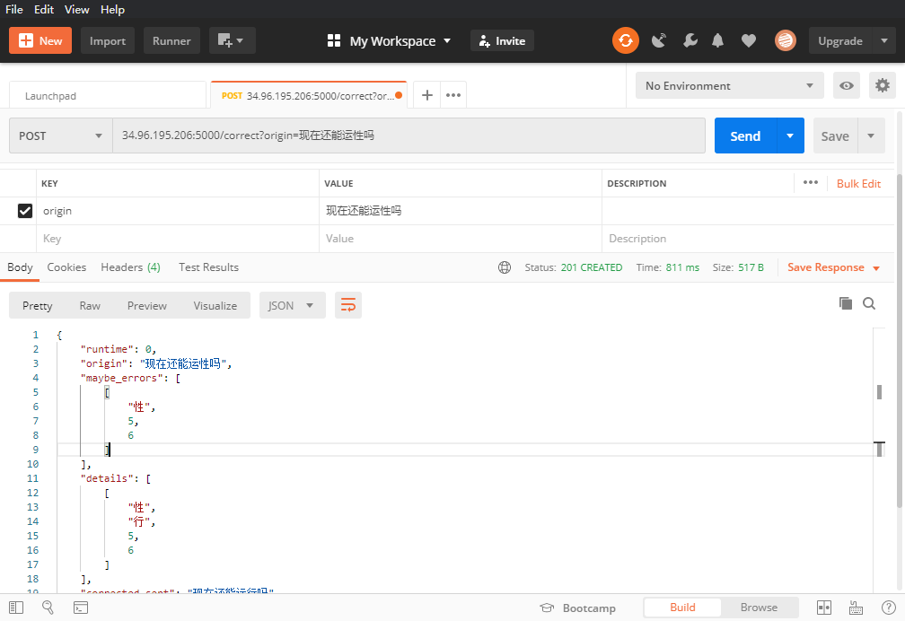

# Chinese-Error-Checking

This is my first attempt in the direction of nlp，it is dedicated to complete a Chinese error detection!

------
#### schedule

- [x] 4.6-4.8 周四前基于Django框架搭建出一个简易的API，可能美化不足。同步进行BERT模型的进一步改进实验。   

  由于一开始对API的开发思路产生了误解，走了一些弯路。目前基于restful框架尝试了一些简易的API搭建，为了进行更加快速的开发，目前使用的是轻量级Flask框架，目前实现了一版简单的通过POST将句子传输到后端并返回修改意见的小sample，进行实际尝试的暴露出一个问题：我们的模型时间复杂度有点高，句子较长（测试100个字符的句子）时用时已较长（约为30s)，目前正在分析各个模块的用时并进行优化。

  

- [x] 4.8-4.12 继续RESTful API开发完善，~~同步进行我们模型的性能优化~~。

  #### API调用方法展示

  目前搭建到阿里云的API调用url为[101.132.106.101:15432/correct](101.132.106.101:15432/correct)，调用的method为POST，传入‘origin'=’待纠错句子‘ 的参数。

  - ##### Postman工具调用方法展示：

  

  

  - ##### requests调用方法

    ```
    from requests import post
    error_sent = '肿瘤娩疫治疗平台有望成为业绩长期增长的新动能。同时，国内一至性评价政策推动，'
    r = post('http://101.132.106.101:15432/correct',data={'origin':error_sent})
    print(r.json())
    
    >>{'runtime': 1, 'origin': '肿瘤娩疫治疗平台有望成为业绩长期增长的新动能。同时，国内一至性评价政策推动，', 'maybe_errors': [['肿瘤', 0, 2], ['娩', 2, 3], ['疫', 3, 4], ['治', 4, 5], ['一至性', 28, 31]], 'details': [['娩', '免', 2, 3], ['一至性', '一致性', 28, 31]], 'corrected_sent': '肿瘤免疫治疗平台有望成为业绩长期增长的新动能。同时，国内一致性评价政策推动，'}
    ```

  - ##### curl调用方法

    ```
    $ curl http://101.132.106.101:15432/correct -d "origin='肿瘤娩疫治疗平台有望成为业绩长期增长的新动能。同时，国内一至性评价政策推动，'" -X POST
    ```

- [ ] 4.13-4.19 下周视API框架开发的完成度，尝试进行服务器端代码迁移工作。（本周本科学校进行 中期检查）

- [ ] 4.20-5.1 进行Demo展示界面的开发。

  ##### 

  

# 解决方案

- 中文纠错分为两步走，第一步是错误检测，第二步是错误纠正；
- 错误检测部分先通过中文分词器切词，由于句子中含有错别字，所以切词结果往往会有切分错误的情况，这样从字粒度和词粒度两方面检测错误，整合这两种粒度的疑似错误结果，形成疑似错误位置候选集；
- 错误纠正部分，是遍历所有的疑似错误位置，并使用音似、形似词典替换错误位置的词，然后通过语言模型计算句子困惑度，对所有候选集结果比较并排序，得到最优纠正词；

# 模型
- 通用语言模型(使用人民日报2014版熟语料)
- 领域特定语言模型（医学领域预料）

## 错误检测
- 字粒度：语言模型困惑度（ppl）检测某字的似然概率值低于句子文本平均值，则判定该字是疑似错别字的概率大。
- 词粒度：切词后不在词典中的词是疑似错词的概率大(新词发现)。

## 错误纠正
- 通过错误检测定位所有疑似错误后，取所有疑似错字的音似、形似候选词;
- 使用候选词替换，基于语言模型得到类似翻译模型的候选排序结果，得到最优纠正词;

# 实验部分
## 1. Data Process

| 文件             | 含义                                                         |
| :--------------- | :----------------------------------------------------------- |
| Extract_PDF.py   | 该文件包含了将PDF抽取出TXT的基本操作，其处理结果为输入一个文件目录，其自动便利此目录下的子目录与.pdf文件，同时将抽取的.txt文件放入到与.pdf同目录下的文件夹中. 抽取模式为利用pdfminer库，实现识别pdf文件中的TEXT信息，并添加启发式规则，合并应该属于同一条语句的TEXT，目前启发式规则仍在不断完善中 |
| TXT2TSV.py       | 实现将抽取的TXT转化为id \t contence \n 格式的.tsv文件，同样输入文件目录，程序自动递归遍历，输出文件再程序同目录下，其基本处理模式为判断中英文标点作为分隔符，并过滤长度<10的句子 |
| tot_acc_sent.tsv | 存放数据相关，包括抽取语料，分词后训练集，未分词测试集等     |
| Model\           | 存放计算出的ngrams模型                                       |
| result\          | c                                                            |

------

## 2. Language Model

### 2.1 kenlm统计语言模型使用(已完成测试)
#### 2.1.1 下载
```bash
https://github.com/kpu/kenlm
```
#### 2.1.2 安装Boost(kenlm需要的依赖)
```bash
下载boost_1_67_0.tar.bz2(https://www.boost.org/users/history/version_1_67_0.html)
tar --bzip2 -xf boost_1_67_0.tar.bz2
cd boost_1_67/
./bootstrap.sh --prefix=/usr/local
sudo ./b2 install --with=all
sudo apt install libbz2-dev
sudo apt install liblzma-dev
```
#### 2.1.3 编译并安装kenlm
```bash
cd kenlm
mkdir -p build
cd build
cmake ..
make -j 4
```
### 2.2 训练领域特定语言模型
#### 2.2.1 数据准备(分词的文件)
```bash
no_id_seg_text.tsv
```
#### 2.2.2 训练模型(在build目录下操作)
```bash
bin/lmplz -o 3 --verbose_header --text no_id_seg_text.tsv --arpa MyModel/log.arpa

-o n:最高采用n-gram语法
-verbose_header:在生成的文件头位置加上统计信息
--text text_file:指定存放预料的txt文件
--arpa:指定输出的arpa文件
```


### 2.3 使用训练的模型纠错
#### 2.3.1 安装kenlm的python包

```bash
pip3 install https://github.com/kpu/kenlm/archive/master.zip
```
#### 2.3.2 将arpa文件转换为binary文件(在build目录下操作)
```bash
bin/build_binary -s MyModel/log.arpa MyModel/log.bin
```

#### 2.3.3 使用训练的模型预测句子的概率
```bash
#encoding:utf8
import kenlm
model = kenlm.Model('MyModel/log.bin')
print(model.score('我 是 中国人 .',bos = True,eos = True))
```


# 算法更新及结果显示

更新文件放入result文件夹下。

```
数据解释：每个错误下有7或4行数据，分别代表检错精确率，检错召回率，检错F1值，纠错精确度，纠错召回率，纠错F1值，句级正确率，部分模型不包括检错模块，因此只具备4行数据

检错精确率：疑似错误中真正包含错误比例，反应“误报”错误
检错召回率：100例错误中被完全检测出的比例，反应“漏报”错误
检错F1值：反应检错模型大致性能
纠错精确率：纠正错误中与真实正确相同的比例，
纠错召回率：100例错误中被完全纠正的比例，
纠错F1值：反应纠错模块大致性能
句级正确率：100例句子被真实纠正的比例
```


<table border="1">
	<tbody>
		<tr>
			<td>
				<p>
					更新文件
				</p>
			</td>
			<td>
				<p>
					算法介绍
				</p>
			</td>
			<td>
				<p>
					同音字
				</p>
			</td>
			<td>
				<p>
					同形字
				</p>
			</td>
			<td>
				<p>
					漏字
				</p>
			</td>
			<td>
				<p>
					同音词
				</p>
			</td>
			<td>
				<p>
					AVE
				</p>
			</td>
			<td>
				<p>
					简易分析
				</p>
			</td>
		</tr>
		<tr>
			<td rowspan="7">
				<p>
					Origin
				</p>
				<p>
					0313.
				</p>
				<p>
					txt
				</p>
			</td>
			<td rowspan="7">
				<p>
					同origin0309，原始模型；不存在加字的处理；不能处理漏字；且改错时强制限制完全同音。
				</p>
			</td>
			<td>
				<p>
					42.9%
				</p>
			</td>
			<td>
				<p>
					46.6%
				</p>
			</td>
			<td>
				<p>
					43.2%
				</p>
			</td>
			<td>
				<p>
					48.5%
				</p>
			</td>
			<td>
				<p>
					45.3%
				</p>
			</td>
			<td rowspan="7">
				<p>
					之前的训练是将提取出的句子进行短切分后划分训练集，猜想其可能损失部分n_gram信息，因此训练一版原始长句子的训练集，此为新版的验证集评估。
				</p>
			</td>
		</tr>
		<tr>
			<td>
				<p>
					88.0%
				</p>
			</td>
			<td>
				<p>
					89.0%
				</p>
			</td>
			<td>
				<p>
					54.0%
				</p>
			</td>
			<td>
				<p>
					32.0%
				</p>
			</td>
			<td>
				<p>
					65.8%
				</p>
			</td>
		</tr>
		<tr>
			<td>
				<p>
					57.7%
				</p>
			</td>
			<td>
				<p>
					61.2%
				</p>
			</td>
			<td>
				<p>
					48.0%
				</p>
			</td>
			<td>
				<p>
					38.6%
				</p>
			</td>
			<td>
				<p>
					53.7%
				</p>
			</td>
		</tr>
		<tr>
			<td>
				<p>
					68.7%
				</p>
			</td>
			<td>
				<p>
					56.9%
				</p>
			</td>
			<td>
				<p>
					0.0%
				</p>
			</td>
			<td>
				<p>
					40.8%
				</p>
			</td>
			<td>
				<p>
					41.6%
				</p>
			</td>
		</tr>
		<tr>
			<td>
				<p>
					82.0%
				</p>
			</td>
			<td>
				<p>
					75.0%
				</p>
			</td>
			<td>
				<p>
					0.0%
				</p>
			</td>
			<td>
				<p>
					19.0%
				</p>
			</td>
			<td>
				<p>
					44.0%
				</p>
			</td>
		</tr>
		<tr>
			<td>
				<p>
					74.8%
				</p>
			</td>
			<td>
				<p>
					64.7%
				</p>
			</td>
			<td>
				<p>
					0.0%
				</p>
			</td>
			<td>
				<p>
					25.9%
				</p>
			</td>
			<td>
				<p>
					42.8%
				</p>
			</td>
		</tr>
		<tr>
			<td>
				<p>
					63.0%
				</p>
			</td>
			<td>
				<p>
					60.0%
				</p>
			</td>
			<td>
				<p>
					0.0%
				</p>
			</td>
			<td>
				<p>
					16.0%
				</p>
			</td>
			<td>
				<p>
					34.8%
				</p>
			</td>
		</tr>
		<tr>
			<td rowspan="7">
				<p>
					Our
				</p>
				<p>
					0313
				</p>
				<p>
					.txt
				</p>
			</td>
			<td rowspan="7">
				<p>
					领域小语料+通用大语料,2.0GB，采用长句子直接提取n_gram信息，关闭漏字更正模块，限制候选拼音相同。
				</p>
			</td>
			<td>
				<p>
					41.7%
				</p>
			</td>
			<td>
				<p>
					47.9%
				</p>
			</td>
			<td>
				<p>
					47.0%
				</p>
			</td>
			<td>
				<p>
					55.2%
				</p>
			</td>
			<td>
				<p>
					48.0%
				</p>
			</td>
			<td rowspan="7">
				<p>
					通过与之前小语料的对比，发现模型在增大语料时能够一定能力增大纠错性能。然而仍然存在较多错检与错纠，并且性能依旧需要依赖于拼音相同等限制，与实际情况存在偏差。
				</p>
			</td>
		</tr>
		<tr>
			<td>
				<p>
					90.0%
				</p>
			</td>
			<td>
				<p>
					90.0%
				</p>
			</td>
			<td>
				<p>
					61.0%
				</p>
			</td>
			<td>
				<p>
					45.0%
				</p>
			</td>
			<td>
				<p>
					71.5%
				</p>
			</td>
		</tr>
		<tr>
			<td>
				<p>
					57.0%
				</p>
			</td>
			<td>
				<p>
					62.5%
				</p>
			</td>
			<td>
				<p>
					53.1%
				</p>
			</td>
			<td>
				<p>
					49.6%
				</p>
			</td>
			<td>
				<p>
					57.4%
				</p>
			</td>
		</tr>
		<tr>
			<td>
				<p>
					84.8%
				</p>
			</td>
			<td>
				<p>
					70.8%
				</p>
			</td>
			<td>
				<p>
					0.0%
				</p>
			</td>
			<td>
				<p>
					58.2%
				</p>
			</td>
			<td>
				<p>
					53.5%
				</p>
			</td>
		</tr>
		<tr>
			<td>
				<p>
					88.0%
				</p>
			</td>
			<td>
				<p>
					83.0%
				</p>
			</td>
			<td>
				<p>
					0.0%
				</p>
			</td>
			<td>
				<p>
					24.0%
				</p>
			</td>
			<td>
				<p>
					48.8%
				</p>
			</td>
		</tr>
		<tr>
			<td>
				<p>
					86.4%
				</p>
			</td>
			<td>
				<p>
					76.4%
				</p>
			</td>
			<td>
				<p>
					0.0%
				</p>
			</td>
			<td>
				<p>
					34.0%
				</p>
			</td>
			<td>
				<p>
					51.0%
				</p>
			</td>
		</tr>
		<tr>
			<td>
				<p>
					78.0%
				</p>
			</td>
			<td>
				<p>
					71.0%
				</p>
			</td>
			<td>
				<p>
					0.0%
				</p>
			</td>
			<td>
				<p>
					24.0%
				</p>
			</td>
			<td>
				<p>
					43.3%
				</p>
			</td>
		</tr>
		<tr>
			<td rowspan="7">
				<p>
					Ours
				</p>
				<p>
					0313_
				</p>
				<p>
					Add
				</p>
				<p>
					.txt
				</p>
			</td>
			<td rowspan="7">
				<p>
					使用上述语料，加入漏字纠错模块，去除候选词的强限制，改为限制简拼相同
				</p>
			</td>
			<td>
				<p>
					31.8%
				</p>
			</td>
			<td>
				<p>
					35.3%
				</p>
			</td>
			<td>
				<p>
					38.2%
				</p>
			</td>
			<td>
				<p>
					39.7%
				</p>
			</td>
			<td>
				<p>
					36.3%
				</p>
			</td>
			<td rowspan="7">
				<p>
					开启漏字纠错后，去除强限制后，可以发现降低了模型其他错误类型纠错准确率与召回率。
				</p>
			</td>
		</tr>
		<tr>
			<td>
				<p>
					97.0%
				</p>
			</td>
			<td>
				<p>
					94.0%
				</p>
			</td>
			<td>
				<p>
					75.0%
				</p>
			</td>
			<td>
				<p>
					69.0%
				</p>
			</td>
			<td>
				<p>
					83.8%
				</p>
			</td>
		</tr>
		<tr>
			<td>
				<p>
					47.9%
				</p>
			</td>
			<td>
				<p>
					51.3%
				</p>
			</td>
			<td>
				<p>
					50.6%
				</p>
			</td>
			<td>
				<p>
					50.4%
				</p>
			</td>
			<td>
				<p>
					50.7%
				</p>
			</td>
		</tr>
		<tr>
			<td>
				<p>
					46.1%
				</p>
			</td>
			<td>
				<p>
					35.2%
				</p>
			</td>
			<td>
				<p>
					25.5%
				</p>
			</td>
			<td>
				<p>
					12.6%
				</p>
			</td>
			<td>
				<p>
					29.8%
				</p>
			</td>
		</tr>
		<tr>
			<td>
				<p>
					73.0%
				</p>
			</td>
			<td>
				<p>
					65.0%
				</p>
			</td>
			<td>
				<p>
					43.0%
				</p>
			</td>
			<td>
				<p>
					18.0%
				</p>
			</td>
			<td>
				<p>
					49.8%
				</p>
			</td>
		</tr>
		<tr>
			<td>
				<p>
					56.5%
				</p>
			</td>
			<td>
				<p>
					45.7%
				</p>
			</td>
			<td>
				<p>
					32.0%
				</p>
			</td>
			<td>
				<p>
					14.8%
				</p>
			</td>
			<td>
				<p>
					37.3%
				</p>
			</td>
		</tr>
		<tr>
			<td>
				<p>
					48.0%
				</p>
			</td>
			<td>
				<p>
					40.0%
				</p>
			</td>
			<td>
				<p>
					28.0%
				</p>
			</td>
			<td>
				<p>
					12.0%
				</p>
			</td>
			<td>
				<p>
					32.0%
				</p>
			</td>
		</tr>
		<tr>
			<td rowspan="7">
				<p>
					aug_
				</p>
				<p>
					0325_
				</p>
				<p>
					o.txt
				</p>
			</td>
			<td rowspan="7">
				<p>
					使用同义词替换增强策略，语料模型184M,关闭漏字更正模块，限制候选拼音相同
				</p>
			</td>
			<td>
				<p>
					41.4%
				</p>
			</td>
			<td>
				<p>
					48.7%
				</p>
			</td>
			<td>
				<p>
					52.6%
				</p>
			</td>
			<td>
				<p>
					55.3%
				</p>
			</td>
			<td>
				<p>
					49.5%
				</p>
			</td>
			<td rowspan="7">
				<p>
					同比利用通用领域增强的语料，在领域语料中利用同义词替换增强策略在200M的数量级可以媲美原始的2G语言模型，并且同形字和同音词的纠错效果更好。
				</p>
			</td>
		</tr>
		<tr>
			<td>
				<p>
					91.0%
				</p>
			</td>
			<td>
				<p>
					95.0%
				</p>
			</td>
			<td>
				<p>
					60.0%
				</p>
			</td>
			<td>
				<p>
					54.0%
				</p>
			</td>
			<td>
				<p>
					75.0%
				</p>
			</td>
		</tr>
		<tr>
			<td>
				<p>
					56.9%
				</p>
			</td>
			<td>
				<p>
					64.4%
				</p>
			</td>
			<td>
				<p>
					56.1%
				</p>
			</td>
			<td>
				<p>
					54.6%
				</p>
			</td>
			<td>
				<p>
					59.6%
				</p>
			</td>
		</tr>
		<tr>
			<td>
				<p>
					85.7%
				</p>
			</td>
			<td>
				<p>
					77.7%
				</p>
			</td>
			<td>
				<p>
					0.0%
				</p>
			</td>
			<td>
				<p>
					68.0%
				</p>
			</td>
			<td>
				<p>
					57.8%
				</p>
			</td>
		</tr>
		<tr>
			<td>
				<p>
					87.0%
				</p>
			</td>
			<td>
				<p>
					88.0%
				</p>
			</td>
			<td>
				<p>
					0.0%
				</p>
			</td>
			<td>
				<p>
					35.0%
				</p>
			</td>
			<td>
				<p>
					52.5%
				</p>
			</td>
		</tr>
		<tr>
			<td>
				<p>
					86.3%
				</p>
			</td>
			<td>
				<p>
					82.5%
				</p>
			</td>
			<td>
				<p>
					0.0%
				</p>
			</td>
			<td>
				<p>
					46.2%
				</p>
			</td>
			<td>
				<p>
					55.0%
				</p>
			</td>
		</tr>
		<tr>
			<td>
				<p>
					78.0%
				</p>
			</td>
			<td>
				<p>
					82.0%
				</p>
			</td>
			<td>
				<p>
					0.0%
				</p>
			</td>
			<td>
				<p>
					35.0%
				</p>
			</td>
			<td>
				<p>
					48.8%
				</p>
			</td>
		</tr>
		<tr>
			<td rowspan="7">
				<p>
					Aug
				</p>
				<p>
					0325_
				</p>
				<p>
					add&amp;s
				</p>
				<p>
					.txt
				</p>
			</td>
			<td rowspan="7">
				<p>
					使用同义词替换增强策略，语料模型184M,加入漏字纠错模块，去除候选词的强限制，改为限制简拼相同。并优同音词生成策略。
				</p>
			</td>
			<td>
				<p>
					37.0%
				</p>
			</td>
			<td>
				<p>
					45.1%
				</p>
			</td>
			<td>
				<p>
					48.4%
				</p>
			</td>
			<td>
				<p>
					50.0%
				</p>
			</td>
			<td>
				<p>
					45.1%
				</p>
			</td>
			<td rowspan="7">
				<p>
					同比利用通用领域增强的语料，模型在开启漏字纠错后，同音字、同形字、同音词的检错均优于通用领域增强语料的结果。
				</p>
			</td>
		</tr>
		<tr>
			<td>
				<p>
					91.0%
				</p>
			</td>
			<td>
				<p>
					96.0%
				</p>
			</td>
			<td>
				<p>
					66.0%
				</p>
			</td>
			<td>
				<p>
					63.0%
				</p>
			</td>
			<td>
				<p>
					79.0%
				</p>
			</td>
		</tr>
		<tr>
			<td>
				<p>
					52.6%
				</p>
			</td>
			<td>
				<p>
					61.4%
				</p>
			</td>
			<td>
				<p>
					55.8%
				</p>
			</td>
			<td>
				<p>
					55.8%
				</p>
			</td>
			<td>
				<p>
					57.4%
				</p>
			</td>
		</tr>
		<tr>
			<td>
				<p>
					60.3%
				</p>
			</td>
			<td>
				<p>
					46.3%
				</p>
			</td>
			<td>
				<p>
					32.4%
				</p>
			</td>
			<td>
				<p>
					30.4%
				</p>
			</td>
			<td>
				<p>
					42.3%
				</p>
			</td>
		</tr>
		<tr>
			<td>
				<p>
					83.0%
				</p>
			</td>
			<td>
				<p>
					69.0%
				</p>
			</td>
			<td>
				<p>
					37.0%
				</p>
			</td>
			<td>
				<p>
					33.0%
				</p>
			</td>
			<td>
				<p>
					55.5%
				</p>
			</td>
		</tr>
		<tr>
			<td>
				<p>
					69.9%
				</p>
			</td>
			<td>
				<p>
					55.4%
				</p>
			</td>
			<td>
				<p>
					34.5%
				</p>
			</td>
			<td>
				<p>
					31.6%
				</p>
			</td>
			<td>
				<p>
					48.0%
				</p>
			</td>
		</tr>
		<tr>
			<td>
				<p>
					53.0%
				</p>
			</td>
			<td>
				<p>
					48.0%
				</p>
			</td>
			<td>
				<p>
					29.0%
				</p>
			</td>
			<td>
				<p>
					27.0%
				</p>
			</td>
			<td>
				<p>
					39.3%
				</p>
			</td>
		</tr>
		<tr>
			<td rowspan="7">
				<p>
					Aug
				</p>
				<p>
					0402_
				</p>
				<p>
					add&amp;s
				</p>
				<p>
					.txt
				</p>
			</td>
			<td rowspan="7">
				<p>
					同aug0325_add&amp;s，在候选打分上加入分词数量的参考，部分解决了漏字模块对非漏字问题处理的负面影响。
				</p>
			</td>
			<td>
				<p>
					37.0%
				</p>
			</td>
			<td>
				<p>
					45.1%
				</p>
			</td>
			<td>
				<p>
					48.4%
				</p>
			</td>
			<td>
				<p>
					49.6%
				</p>
			</td>
			<td>
				<p>
					45.0%
				</p>
			</td>
			<td rowspan="7">
				<p>
					相较于上面的结果漏字处理能力保留的同时将同音同形字处理的负影响降低，结果为目前AVE准确率最高的模型。
				</p>
			</td>
		</tr>
		<tr>
			<td>
				<p>
					91.0%
				</p>
			</td>
			<td>
				<p>
					96.0%
				</p>
			</td>
			<td>
				<p>
					66.0%
				</p>
			</td>
			<td>
				<p>
					63.0%
				</p>
			</td>
			<td>
				<p>
					79.0%
				</p>
			</td>
		</tr>
		<tr>
			<td>
				<p>
					52.6%
				</p>
			</td>
			<td>
				<p>
					61.3%
				</p>
			</td>
			<td>
				<p>
					55.8%
				</p>
			</td>
			<td>
				<p>
					55.5%
				</p>
			</td>
			<td>
				<p>
					57.3%
				</p>
			</td>
		</tr>
		<tr>
			<td>
				<p>
					80.4%
				</p>
			</td>
			<td>
				<p>
					69.7%
				</p>
			</td>
			<td>
				<p>
					46.3%
				</p>
			</td>
			<td>
				<p>
					48.3%
				</p>
			</td>
			<td>
				<p>
					61.2%
				</p>
			</td>
		</tr>
		<tr>
			<td>
				<p>
					82.0%
				</p>
			</td>
			<td>
				<p>
					67.0%
				</p>
			</td>
			<td>
				<p>
					36.0%
				</p>
			</td>
			<td>
				<p>
					35.0%
				</p>
			</td>
			<td>
				<p>
					55.0%
				</p>
			</td>
		</tr>
		<tr>
			<td>
				<p>
					81.2%
				</p>
			</td>
			<td>
				<p>
					68.3%
				</p>
			</td>
			<td>
				<p>
					40.5%
				</p>
			</td>
			<td>
				<p>
					40.6%
				</p>
			</td>
			<td>
				<p>
					57.9%
				</p>
			</td>
		</tr>
		<tr>
			<td>
				<p>
					71.0%
				</p>
			</td>
			<td>
				<p>
					63.0%
				</p>
			</td>
			<td>
				<p>
					33.0%
				</p>
			</td>
			<td>
				<p>
					32.0%
				</p>
			</td>
			<td>
				<p>
					49.8%
				</p>
			</td>
		</tr>
		<tr>
			<td rowspan="7">
				<p>
					Correc
				</p>
				<p>
					tion
				</p>
				<p>
					_word_
				</p>
				<p>
					0314.tx
				</p>
			</td>
			<td rowspan="7">
				<p>
					使用新划分的训练集与测试集，重新对其使用的多个语料进行训练，关闭漏字纠错。
				</p>
			</td>
			<td>
				<p>
					33.1%
				</p>
			</td>
			<td>
				<p>
					34.3%
				</p>
			</td>
			<td>
				<p>
					45.7%
				</p>
			</td>
			<td>
				<p>
					45.5%
				</p>
			</td>
			<td>
				<p>
					39.6%
				</p>
			</td>
			<td rowspan="7">
				<p>
					由于其候选的过滤更为粗糙，但是其纠错正确率却高于我们的模型，认为为候选打分的方式值得借鉴，下一步我们的模型将尝试加入该模型的打分方式进行对比。
				</p>
			</td>
		</tr>
		<tr>
			<td>
				<p>
					97.0%
				</p>
			</td>
			<td>
				<p>
					96.0%
				</p>
			</td>
			<td>
				<p>
					77.0%
				</p>
			</td>
			<td>
				<p>
					86.0%
				</p>
			</td>
			<td>
				<p>
					89.0%
				</p>
			</td>
		</tr>
		<tr>
			<td>
				<p>
					49.4%
				</p>
			</td>
			<td>
				<p>
					50.5%
				</p>
			</td>
			<td>
				<p>
					57.4%
				</p>
			</td>
			<td>
				<p>
					59.5%
				</p>
			</td>
			<td>
				<p>
					54.8%
				</p>
			</td>
		</tr>
		<tr>
			<td>
				<p>
					57.6%
				</p>
			</td>
			<td>
				<p>
					60.4%
				</p>
			</td>
			<td>
				<p>
					6.9%
				</p>
			</td>
			<td>
				<p>
					35.4%
				</p>
			</td>
			<td>
				<p>
					40.1%
				</p>
			</td>
		</tr>
		<tr>
			<td>
				<p>
					60.0%
				</p>
			</td>
			<td>
				<p>
					65.0%
				</p>
			</td>
			<td>
				<p>
					10.0%
				</p>
			</td>
			<td>
				<p>
					17.0%
				</p>
			</td>
			<td>
				<p>
					38.0%
				</p>
			</td>
		</tr>
		<tr>
			<td>
				<p>
					58.8%
				</p>
			</td>
			<td>
				<p>
					62.6%
				</p>
			</td>
			<td>
				<p>
					8.2%
				</p>
			</td>
			<td>
				<p>
					23.0%
				</p>
			</td>
			<td>
				<p>
					39.0%
				</p>
			</td>
		</tr>
		<tr>
			<td>
				<p>
					54.0%
				</p>
			</td>
			<td>
				<p>
					52.0%
				</p>
			</td>
			<td>
				<p>
					0.0%
				</p>
			</td>
			<td>
				<p>
					16.0%
				</p>
			</td>
			<td>
				<p>
					30.5%
				</p>
			</td>
		</tr>
		<tr>
			<td rowspan="4">
				<p>
					Baidu
				</p>
				<p>
					_api.
				</p>
				<p>
					txt
				</p>
			</td>
			<td rowspan="4">
				<p>
					远程调用百度云中提供的中文纠错API进行纠错尝试，从结构来看，其不能处理漏字，前不返回检错信息。
				</p>
			</td>
			<td>
				<p>
					79.2%
				</p>
			</td>
			<td>
				<p>
					72.7%
				</p>
			</td>
			<td>
				<p>
					0.0%
				</p>
			</td>
			<td>
				<p>
					77.8%
				</p>
			</td>
			<td>
				<p>
					57.4%
				</p>
			</td>
			<td rowspan="4">
				<p>
					从效果来看，百度提供的API在同音和同形的检错上表现并不佳，在同音词表现与n-gram模型以及BERT模型更为接近。
				</p>
			</td>
		</tr>
		<tr>
			<td>
				<p>
					20.0%
				</p>
			</td>
			<td>
				<p>
					20.0%
				</p>
			</td>
			<td>
				<p>
					0.0%
				</p>
			</td>
			<td>
				<p>
					24.0%
				</p>
			</td>
			<td>
				<p>
					16.0%
				</p>
			</td>
		</tr>
		<tr>
			<td>
				<p>
					31.9%
				</p>
			</td>
			<td>
				<p>
					31.4%
				</p>
			</td>
			<td>
				<p>
					0.0%
				</p>
			</td>
			<td>
				<p>
					36.7%
				</p>
			</td>
			<td>
				<p>
					25.0%
				</p>
			</td>
		</tr>
		<tr>
			<td>
				<p>
					18.0%
				</p>
			</td>
			<td>
				<p>
					17.0%
				</p>
			</td>
			<td>
				<p>
					0.0%
				</p>
			</td>
			<td>
				<p>
					23.0%
				</p>
			</td>
			<td>
				<p>
					14.5%
				</p>
			</td>
		</tr>
		<tr>
			<td rowspan="4">
				<p>
					Autoch
				</p>
				<p>
					echer4
				</p>
				<p>
					Chine
				</p>
				<p>
					se_log
				</p>
				<p>
					.txt
				</p>
			</td>
			<td rowspan="4">
				<p>
					基于预训练的词频信息进行纠错，对每一个词频小于设定阈值的词均进行纠错尝试，同样不具备独立的纠错模块。
				</p>
			</td>
			<td>
				<p>
					40.0%
				</p>
			</td>
			<td>
				<p>
					14.0%
				</p>
			</td>
			<td>
				<p>
					6.8%
				</p>
			</td>
			<td>
				<p>
					10.9%
				</p>
			</td>
			<td>
				<p>
					17.9%
				</p>
			</td>
			<td rowspan="4">
				<p>
					基于词频的纠错模型，理论上要比基于n-grams的模型更弱效一些。实验结果与预期相同。
				</p>
			</td>
		</tr>
		<tr>
			<td>
				<p>
					38.0%
				</p>
			</td>
			<td>
				<p>
					12.0%
				</p>
			</td>
			<td>
				<p>
					0.0%
				</p>
			</td>
			<td>
				<p>
					2.0%
				</p>
			</td>
			<td>
				<p>
					13.0%
				</p>
			</td>
		</tr>
		<tr>
			<td>
				<p>
					39.0%
				</p>
			</td>
			<td>
				<p>
					12.9%
				</p>
			</td>
			<td>
				<p>
					0.0%
				</p>
			</td>
			<td>
				<p>
					3.4%
				</p>
			</td>
			<td>
				<p>
					15.1%
				</p>
			</td>
		</tr>
		<tr>
			<td>
				<p>
					27.0%
				</p>
			</td>
			<td>
				<p>
					8.0%
				</p>
			</td>
			<td>
				<p>
					0.0%
				</p>
			</td>
			<td>
				<p>
					2.0%
				</p>
			</td>
			<td>
				<p>
					9.3%
				</p>
			</td>
		</tr>
		<tr>
			<td>
				<p>
					<br />
				</p>
			</td>
			<td>
				<p>
					<br />
				</p>
			</td>
			<td>
				<p>
					<br />
				</p>
			</td>
			<td>
				<p>
					<br />
				</p>
			</td>
			<td>
				<p>
					<br />
				</p>
			</td>
			<td>
				<p>
					<br />
				</p>
			</td>
			<td>
				<p>
					<br />
				</p>
			</td>
			<td>
				<p>
					<br />
				</p>
			</td>
		</tr>
	</tbody>
</table>


## 深度算法更新及结果展示

```
基于BERT模型的纠错效果（不进行检错），更新了其漏字处理的模块，并进行了一些优化，目前尚存在优化空间且已经在ngram模型中进行实践检验，尚未迭代到BERT模型中。

```


<table border="1">
	<tbody>
		<tr>
			<td>
				<p>
					更新文件
				</p>
			</td>
			<td>
				<p>
					算法介绍
				</p>
			</td>
			<td>
				<p>
					同音字
				</p>
			</td>
			<td>
				<p>
					同形字
				</p>
			</td>
			<td>
				<p>
					漏字
				</p>
			</td>
			<td>
				<p>
					同音词
				</p>
			</td>
			<td>
				<p>
					AVE
				</p>
			</td>
			<td>
				<p>
					简易分析
				</p>
			</td>
		</tr>
		<tr>
			<td rowspan="4">
				<p>
					BERT_
				</p>
				<p>
					origin
				</p>
				<p>
					0318
				</p>
				<p>
					.txt
				</p>
			</td>
			<td rowspan="4">
				<p>
					利用作者预先fine-tuned的MLM模型（人名日报2014版数据），纠错方案为对句子中每个位置设置MASK，令BERT模型对其进行预测，将预测集中第一个再混淆集中的字作为正确字返回，不包括检错。
				</p>
			</td>
			<td>
				<p>
					86.7%
				</p>
			</td>
			<td>
				<p>
					88.2%
				</p>
			</td>
			<td>
				<p>
					0.0%
				</p>
			</td>
			<td>
				<p>
					86.0%
				</p>
			</td>
			<td>
				<p>
					65.2%
				</p>
			</td>
			<td rowspan="4">
				<p>
					由于是对句子中的每一个字进行BERT的再预测，因此其不需要检错模块。模型将BERT中预测分数较高、且在当前字的混淆集中的结果视为错误字的纠正。这种模式无法进行漏字纠错。结果显示比规则式纠错在同音与同形字上工作更好。
				</p>
			</td>
		</tr>
		<tr>
			<td>
				<p>
					79.0%
				</p>
			</td>
			<td>
				<p>
					82.0%
				</p>
			</td>
			<td>
				<p>
					0.0%
				</p>
			</td>
			<td>
				<p>
					27.0%
				</p>
			</td>
			<td>
				<p>
					47.0%
				</p>
			</td>
		</tr>
		<tr>
			<td>
				<p>
					82.7%
				</p>
			</td>
			<td>
				<p>
					85.0%
				</p>
			</td>
			<td>
				<p>
					0.0%
				</p>
			</td>
			<td>
				<p>
					41.1%
				</p>
			</td>
			<td>
				<p>
					54.6%
				</p>
			</td>
		</tr>
		<tr>
			<td>
				<p>
					72.0%
				</p>
			</td>
			<td>
				<p>
					74.0%
				</p>
			</td>
			<td>
				<p>
					0.0%
				</p>
			</td>
			<td>
				<p>
					26.0%
				</p>
			</td>
			<td>
				<p>
					43.0%
				</p>
			</td>
		</tr>
		<tr>
			<td rowspan="4">
				<p>
					BERT_
				</p>
				<p>
					Add
				</p>
				<p>
					0402
				</p>
				<p>
					.txt
				</p>
			</td>
			<td rowspan="4">
				<p>
					将BERT模型与ngram模型尝试进行了融合，并进行了一般简单的优化。
				</p>
			</td>
			<td>
				<p>
					52.3%
				</p>
			</td>
			<td>
				<p>
					52.2%
				</p>
			</td>
			<td>
				<p>
					0.0%
				</p>
			</td>
			<td>
				<p>
					38.0%
				</p>
			</td>
			<td>
				<p>
					35.6%
				</p>
			</td>
			<td rowspan="4">
				<p>
					可以看到BERT模型同样出现了严重的纠错模块影响同音同形字处理的现象，但是其漏字的处理性能是目前最优的性能。由于模型尚在修改，纠错性能的统计好像存在问题，但是句级正确率正确。
				</p>
			</td>
		</tr>
		<tr>
			<td>
				<p>
					78.0%
				</p>
			</td>
			<td>
				<p>
					83.0%
				</p>
			</td>
			<td>
				<p>
					54.0%
				</p>
			</td>
			<td>
				<p>
					33.0%
				</p>
			</td>
			<td>
				<p>
					62.0%
				</p>
			</td>
		</tr>
		<tr>
			<td>
				<p>
					62.7%
				</p>
			</td>
			<td>
				<p>
					64.1%
				</p>
			</td>
			<td>
				<p>
					0.0%
				</p>
			</td>
			<td>
				<p>
					35.3%
				</p>
			</td>
			<td>
				<p>
					45.3%
				</p>
			</td>
		</tr>
		<tr>
			<td>
				<p>
					34.0%
				</p>
			</td>
			<td>
				<p>
					29.0%
				</p>
			</td>
			<td>
				<p>
					48.0%
				</p>
			</td>
			<td>
				<p>
					15.0%
				</p>
			</td>
			<td>
				<p>
					31.5%
				</p>
			</td>
		</tr>
		<tr>
			<td>
				<p>
					<br />
				</p>
			</td>
			<td>
				<p>
					<br />
				</p>
			</td>
			<td>
				<p>
					<br />
				</p>
			</td>
			<td>
				<p>
					<br />
				</p>
			</td>
			<td>
				<p>
					<br />
				</p>
			</td>
			<td>
				<p>
					<br />
				</p>
			</td>
			<td>
				<p>
					<br />
				</p>
			</td>
			<td>
				<p>
					<br />
				</p>
			</td>
		</tr>
	</tbody>
</table>
<p>
	<br />
</p>